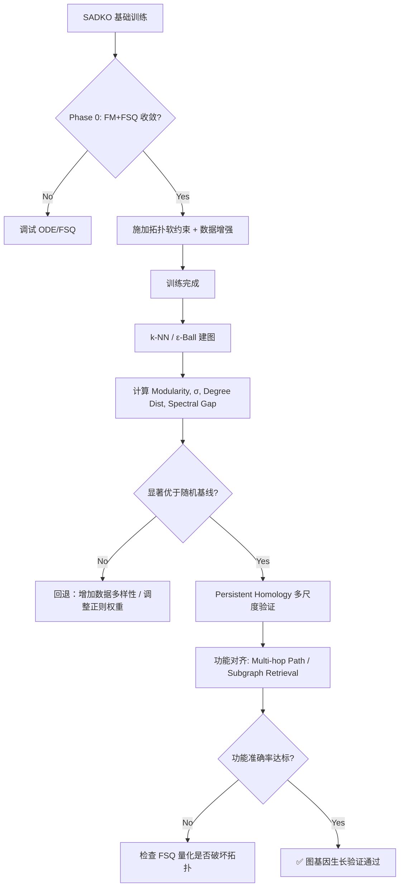

# SADKO 右脑图结构涌现机制：促生长与证生长

> **一句话定位**：右脑（Hippo）latent space 中图拓扑如何"生长"出来（训练策略）以及如何证明它长出来了（图论分析工具箱）
> **关联文档**：[hippo-vs-gdm-review.md](./hippo-vs-gdm-review.md)（为什么放弃显式 GDM）· [hippo-phase0-manual.md](./hippo-phase0-manual.md)（Phase 0 验证执行）
> **最后更新**：2026-07-29

---

## 〇、 核心命题：图结构是涌现的，不是训练的

SADKO 的右脑本质上是一个**连续流形上的动力系统**。所谓"图结构生长"，在数学上等价于：**Flow Matching 学到的速度场 $v_\theta(z, t)$，其积分轨迹自发地同构于底层知识的拓扑图。**

### 0.1 为什么不应该显式定义图结构损失？

**不要定义 $\mathcal{L}_{graph}$，不要建图再算 Loss，不要用 GNN Loss。** 显式图损失有三大危害：

| 危害 | 解释 |
| :--- | :--- |
| **循环论证** | 你需要先建图才能算图损失，但建图本身就需要预设结构假设（k-NN? 共现? 依存?）。用预设的图去训练模型学图，学到的只是你的偏见。 |
| **梯度冲突** | $\mathcal{L}_{recon}$ 要求精确还原 KV，$\mathcal{L}_{graph}$ 要求满足某种拓扑。两者梯度方向往往不一致，导致训练震荡或收敛到平庸解。 |
| **过拟合伪结构** | 文本表面的共现图 ≠ 认知所需的推理图。显式图损失会让模型记住表面统计规律，而非学到可泛化的语义拓扑。 |

### 0.2 正确的逻辑链：重构损失 + 双向注意力 = 隐式图生长

```text
前提1: 右脑编码器是双向全连接注意力（无因果Mask）
前提2: 训练目标是精确重构原始KV（最小化Recon MSE）
前提3: KV中存在大量长程依赖、实体共指、关系约束

推论: 为了在有限M个Memory Token下最小化重构误差，
      模型必须将语义相关的KV聚类到同一Token（→节点形成）
      必须在Token间建立可传递信息的通道（→边形成）
      必须保留多跳路径以支持跨段重构（→图的连通性）

结论: 图结构是双向注意力在重构压力下的几何必然
```

**反向传播训练的始终是 $\mathcal{L}_{vel} + \mathcal{L}_{recon}$，图结构是这个优化过程的涌现属性。**

### 0.3 FM 编码后的数据形态

经过 FM 编码后，得到的**不是**单向量，而是**离散码字序列**：

$$ \text{KV}_{L \times D} \xrightarrow{\text{FM Encoder (Bidir)}} z_{M \times D} \xrightarrow{\text{FSQ}} c_{M \times K} $$

- **$L$**：原始 KV 序列长度（如 2048）
- **$M$**：压缩后的 Memory Token 数量（如 64/128/256），$M \ll L$
- **$K$**：FSQ 量化维度数（如 4-6 个维度）
- **输出形态**：`c` 是 shape 为 `[B, M, K]` 的整数张量，每个 Memory Token 由 $K$ 个离散码字联合表示

> **为什么必须是序列而非单向量？** 知识具有组合性。单个全局向量只能做语义检索（类似 CLS token），无法承载实体-关系-属性的结构化拓扑。序列化的离散码字才能通过位置间相互作用（解码时）重组出子图结构。FSQ 的多维特性允许每个 Token 同时编码"实体类型+关系角色+时序状态"等多重因子。

---

## 一、 促生长：训练策略

不要直接教模型"什么是图"，而是创造一种环境，使得 **"形成图结构是压缩损失最小的唯一解"**。

### 1.1 数据层面的"几何压力"

| 策略 | 比例/参数 | 作用 |
| :--- | :--- | :--- |
| **长程依赖增强采样** | 30% 样本为 Multi-hop / Cross-document / Temporal 类型 | 若数据全是单句事实，双向注意力退化为局部平滑，无法形成全局图拓扑 |
| **实体/关系掩码扰动** | 随机 Mask 15% 的实体或关系词 | 迫使 FM 通过其他节点状态推断被 Mask 部分，模拟图上"消息传递" |
| **同义/多指对齐样本** | 显式构造"A=B"、"A alias B"样本 | 在 latent space 施加"吸引子"力，同一实体不同表征坍缩到同一区域，形成节点聚类 |

### 1.2 损失函数的"拓扑软约束"（不预设具体拓扑）

| 辅助损失 | 公式/机制 | 作用 | 为何安全 |
| :--- | :--- | :--- | :--- |
| **流形一致性 $\mathcal{L}_{manifold}$** | $\| v_\theta(z_i, t) - v_\theta(z_j, t) \|_2^2 \cdot \exp(-d_{text}(x_i, x_j)/\tau)$，$d_{text}$ 为原文依存距离或共现频率 | 语义/结构相近的点速度场方向一致——图上"边"的连续松弛 | 不指定谁和谁相连，只要求局部平滑 |
| **FSQ 正交性 $\mathcal{L}_{orth}$** | 对量化后码字向量施加正交约束（如 Grassmannian loss） | 防止所有事实挤在同一维，迫使不同轴表示不同关系类型（边类型分离） | 促进因子解耦，利于组合结构涌现 |
| **ODE 路径长度 $\mathcal{L}_{path}$** | 惩罚 $\int \|v_\theta(z_t, t)\| dt$ | 最短路径原则促使 latent space 形成低曲率、高连通流形——知识图谱的几何特征 | 无拓扑预设的纯几何约束 |

> **关键区分**：$\mathcal{L}_{graph}$ = "你必须长成这棵树的样子" → **禁止**；$\mathcal{L}_{manifold}$ + 双向注意力 + 重构损失 = "给你阳光水土，你自己长成树" → **正确**。

### 1.3 架构层面的"生长支架"

- **RoPE 的双向适配**：标准 RoPE 是因果的。右脑中改用 **Symmetric RoPE** 或 **ALiBi-Bidirectional**，确保位置编码不破坏全连接对称性，否则双向注意力会被位置偏置扭曲为伪因果结构。
- **FSQ 维度选择**：量化维度 $D$ 决定图的"嵌入维度"。经验法则：$D \approx \log_2(N_{entities}) + R_{relations}$。过小则图结构被压扁，过大则稀疏无法形成连通分量。建议从 64/128 起步做消融。

---

## 二、 证生长：图论分析工具箱

将连续 Latent Space 转化为离散图进行分析：**采样点 → 建图 → 计算图不变量 → 与基准对比**。

### Step 1: 从连续流形到离散图

| 方法 | 适用场景 | 操作 |
| :--- | :--- | :--- |
| **k-NN Graph** | 通用，最稳健 | 对 FSQ 码字或去噪后 latent 建 k-NN 图，边权=余弦相似度 |
| **ε-Ball Graph** | 检测密度均匀性 | 固定半径 ε，仅连接距离 <ε 的点对 |
| **Persistent Homology** | **黄金标准** | 不依赖单一阈值，分析多尺度下的拓扑特征（Betti numbers） |
| **Attention Map Graph** | 验证机制 | 直接用右脑双向 Attention Matrix 作为邻接矩阵（阈值化后） |

> ⚠️ 必须同时分析 **FSQ 离散码字空间** 和 **连续 latent 空间**。若仅在连续空间有结构而 FSQ 无结构，说明量化过程破坏了拓扑，记忆提取将失败。

### Step 2: 核心图论指标与预期

与两个基准对比：**随机图基线**（相同度分布的 Erdős–Rényi 图）和**文本表面图基线**（仅基于原文共现建的图）。

| 图论指标 | 含义 | "图基因生长"的预期信号 | 失败信号 |
| :--- | :--- | :--- | :--- |
| **Modularity (Q)** | 社区结构强度 | Q > 0.4 且显著高于随机基线 (p<0.001) | Q ≈ 0 → 无聚类；Q ≈ 1 → 过度碎片化 |
| **Small-Worldness (σ)** | 小世界特性 | σ > 1（高聚类系数 + 短平均路径） | σ ≈ 1 → 随机图；σ >> 3 → 规则网格 |
| **Degree Distribution** | 度分布形态 | **幂律分布** $P(k) \sim k^{-\gamma}$, γ∈[2,3] | 指数分布 → 无枢纽节点；均匀分布 → 无层级 |
| **Spectral Gap (λ₂)** | 代数连通度 | λ₂ > 0 且与文本表面图的 λ₂ 相关性强 | λ₂ ≈ 0 → 图不连通；λ₂ 与文本无关 → 学到噪声 |
| **Betti Numbers (β₀, β₁)** | 连通分量/环数 | β₀ 接近实体类别数；β₁ > 0（语义环 A→B→C→A） | β₀=1 → 全连通团；β₁=0 → 纯树状无推理环 |
| **Node Centrality vs Entity Freq** | 中心性与语义重要性相关性 | Spearman ρ > 0.6（核心实体 = 高度中心节点） | ρ ≈ 0 → 拓扑与语义脱节 |

### Step 3: 高级验证——功能对齐测试

仅有拓扑不够，必须证明**图结构服务于认知功能**：

- **Multi-hop Path Existence**：对测试集中的 multi-hop QA (A→B→C)，在 latent 图中检查对应路径。要求：路径存在率 >80%，且路径长度 ≤ hop 数 + 1。
- **Subgraph Retrieval Accuracy**：给定 query，用 graph diffusion/random walk 在 latent 图上检索子图再解码回答。准确率应 ≥ Cross-Attention 直接检索的 95%。**证明图结构是可操作的，不仅是统计假象。**
- **Counterfactual Robustness**：修改图中某节点的 latent（模拟事实更新），检查相关邻居节点是否通过图结构自动调整（无需重训）。调整幅度应与图距离负相关。

### 工具链

| 用途 | 工具 | 备注 |
| :--- | :--- | :--- |
| 图构建与分析 | `networkx`, `igraph` | 基础指标计算 |
| 持久同调 | `giotto-tda`, `ripser` | 多尺度拓扑分析，**强烈推荐** |
| 流形学习/可视化 | `umap-learn`, `trimap` | 比 t-SNE 更保全局结构 |
| 谱分析 | `scipy.sparse.linalg`, `pygsp` | 图信号处理 |
| 功能对齐测试 | 自研 Pipeline | 结合 LLM-as-Judge |

---

## 三、 分子自组装范式（mRNA 比喻的精确对齐）

### 3.1 生物学映射

> **FSQ 码字序列不是 DNA，而是 mRNA（信使RNA）；双向注意力 + Flow Matching 是核糖体；重构出的 KV Cache 是氨基酸链；图结构是蛋白质折叠后的三维构象。**

| 生物学概念 | SADKO 对应物 | 映射理由 |
| :--- | :--- | :--- |
| **DNA** | 原始文本 / 知识库 | 永久存储、冗余、不可直接执行 |
| **mRNA** | FSQ 码字序列 `[B, M, K]` | 临时、压缩、可运输、离散编码，携带构建指令但本身不是功能体 |
| **核糖体** | FM Decoder + Cross-Attention | 读取 mRNA 序列"翻译"成氨基酸链（KV） |
| **氨基酸链** | 重构的 KV Cache | 线性序列，尚未具备功能 |
| **蛋白质折叠** | KV 在左脑中的使用过程 | 线性序列在上下文中自发折叠为功能结构（推理所需子图） |
| **分子伴侣** | Fact-Gate / 扩散对齐桥梁 | 辅助正确折叠，防止错误聚合 |

> **关键洞察**：FSQ 码字序列本身不包含显式图拓扑，它包含的是**生成图的指令**。同一个 FSQ 码字序列，在不同左脑上下文中可以"折叠"出不同的子图——这正是记忆系统需要的上下文敏感性。

### 3.2 比喻对训练的三大指导

1. **不要在 mRNA 阶段期待蛋白质形状**：Phase 0 中 FSQ 码字空间应呈现**因子解耦的离散簇**（类似密码子表），而非完整图。图结构只在解码后的 KV 空间或左脑使用时才显现。UMAP 监控应关注聚类度和维度正交性；社区结构在 KV 重构空间或 Attention Map 中验证。
2. **"折叠"需要正确的物理环境**：Recon Loss = 热力学约束；双向注意力 = 溶剂环境；Cross-Attn = 分子伴侣；ODE 可逆性 = 折叠/去折叠平衡。**若 Recon MSE 低但图结构未涌现，问题在"折叠环境"（双向注意力是否充分、ODE 是否可逆），而非"密码子"（FSQ 设计）。**
3. **突变实验是最好的结构探针**：单码字扰动（变化局部=模块化结构形成；全局弥散=未稳定折叠）、码字交换（同义突变验证鲁棒性）、截断实验（结构域独立性）。

### 3.3 比喻的边界

| 生物学事实 | SADKO 差异 | 工程含义 |
| :--- | :--- | :--- |
| DNA→蛋白质单向中心法则 | SADKO 的 ODE 可逆 | 可从 KV "逆转录"回 FSQ 码字，压缩-解压对称性的基础 |
| 蛋白质折叠自发 | KV 的"图折叠"依赖左脑上下文 | 同一 Memory 在不同 query 下激活不同子图，是优势而非缺陷 |
| 遗传密码通用 | FSQ 码字语义是习得的 | 不同训练 run 码字含义不同，不能跨模型迁移 |
| 突变随机 | SADKO 的"突变"是受控探针 | 用于验证，而非训练手段 |

### 3.4 自组装的三个阶段

1. **成核阶段（Nucleation）| 训练早期**：高频实体/关系的 KV 在 latent 空间聚集（出现频率最高，压缩收益最大）。观测：FSQ 码字利用率快速上升，少数码字主导。
2. **延伸阶段（Elongation）| 训练中期**：围绕核心簇，低频 KV 被"吸附"形成模块化社区（双向注意力让已成簇作为模板降低整合成本）。观测：Attention Map 出现块状结构，Recon MSE 加速下降。
3. **退火阶段（Annealing）| 训练后期**：模块间建立稀疏连接，全局拓扑稳定（ODE 路径惩罚 + 流形一致性充当"分子伴侣"消除错误折叠）。观测：Spectral Gap 稳定，ODE Cycle Error 收敛。

整个过程中梯度只流过 $\mathcal{L}_{recon}$ 和 $\mathcal{L}_{vel}$。**图结构从未出现在计算图中，它是优化轨迹的几何投影。**

---

## 四、 KV Cache 输入的设计要求（"转录酶"与"底物"）

### 4.1 主干 AR 网络的"转录酶改造"

普通 LLM 的 KV Cache 为下一个 Token 预测优化，信息分布偏向局部语法——像富含甘氨酸的无序肽链，缺乏折叠核。

| 改造策略 | 分子生物学类比 | 具体操作 |
| :--- | :--- | :--- |
| **结构化 SFT** | 定向进化 | 用 Multi-hop QA、实体关系抽取、因果推理数据微调主干，迫使 KV 编码长程依赖 |
| **KV 正则化** | 密码子优化 | 训练时对 KV 施加正交性或低秩约束，减少冗余，增加信息密度 |
| **多层级 KV 提取** | 选择性剪接 | 不仅取最后一层 KV，融合中间层 KV，捕获不同抽象层级结构 |
| **实体锚点增强** | 信号肽添加 | 输入中对关键实体加特殊标记，使其在 KV 中形成高显著性"折叠核" |

主干须满足的四个条件及验证：KV 可分离性（PCA 主成分解释方差均匀）、长程注意力有效（KV 预测相距 >512 token 的实体关系）、实体绑定能力（同义实体 KV 余弦相似度显著高于随机对）、层级抽象（浅层探针测词法、深层测语义角色）。不满足时：短期用 PCA 白化 + 实体均值池化补救，长期必须结构化微调主干。

### 4.2 训练数据的"底物纯度"

- **✅ 优质底物**：百科条目（实体-属性密集）、法律/医学文档（规则-条件嵌套）、Multi-hop 推理链、时间线叙事
- **❌ 劣质底物**：纯对话闲聊、代码片段（语法树≠知识图）、列表表格（扁平无折叠压力）、重复模板文本（信息熵过低）
- **黄金比例**：**70% 结构化文档 + 20% Multi-hop QA + 10% 通用文本**——模拟细胞内"分子伴侣"浓度，足以引导正确折叠又不至于过拟合人工结构

---

## 五、 为什么必须解压重构（压缩率不是充分条件）

**仅靠控制压缩率无法让图结构生长，只会得到"热力学死寂"的熵。**

### 5.1 三个理由

1. **压缩率是"压力"，不是"模具"**：压缩率（$L/M$）提供自由能梯度迫使系统寻找高效表征，但不指定方向。没有重构损失作为选择压，模型会收敛到信息论最优压缩（如 Huffman 编码）而非认知最优结构——Huffman 编码是完美压缩但没有任何图结构。
2. **解压提供相互作用介质**：为了解压出正确 KV，Decoder 必须在 Memory Token 间建立信息传递通道——这些通道就是图的边。不需要解压，Memory Token 间就没有交互动力。**没有交互 = 没有图。**
3. **Anfinsen 法则的完整表述**：天然构象是氨基酸序列**在给定生理环境下**的热力学最稳态。氨基酸序列 = FSQ 码字；生理环境 = FM Decoder + 双向注意力 + 重构目标；天然构象 = 知识图谱。去掉"生理环境"，法则不成立。

### 5.2 核心公式

$$ \text{Graph Structure} = \arg\min_{z} \underbrace{\mathcal{L}_{recon}(KV, \text{Decode}(z))}_{\text{溶剂相互作用}} + \lambda \cdot \underbrace{\text{CompressRatio}(z)}_{\text{热力学压力}} $$

**重构是目的，压缩是约束。顺序颠倒，图结构就不会生长。**

### 5.3 Phase 0 中的验证方法

1. **消融实验（必做）**：配置 A（完整：Encoder + FSQ + Decoder + Recon Loss）vs 配置 B（无解压：仅用码字做下游任务）。预期 B 的下游性能显著低于 A 且 Attention Map 无块状结构——证明图结构存在于解码动力学中而非静态码字中。
2. **Recon MSE vs Spectral Gap 耦合曲线**：健康信号 = 两者同步改善；危险信号 = MSE 降但 Spectral Gap 不变（模型找到非结构化压缩捷径，需增加数据多样性或几何软约束）。
3. **解码器注意力即图邻接矩阵**：训练后期提取 FM Decoder 的 Cross-Attention 权重矩阵阈值化后计算图指标，应随 Recon Loss 下降而单调改善——这是"解压过程生长出图"的直接证据。

---

## 六、 行动路线图



> **核心原则**："生长"不是玄学，而是优化压力下的几何必然。促生长靠"让非图结构成为高损失解"；证生长靠"用图不变量量化 latent space 的非随机性，并用功能测试证明该非随机性是语义相关的"。
>
> **不要追求完美的图。追求一个"足够支撑 multi-hop 推理的最小拓扑结构"。** 右脑不需要成为 Wikidata，只需要成为一个可导航的语义流形。当 latent 图在小世界性和 multi-hop 路径存在率上显著超越随机基线时，就已成功。
