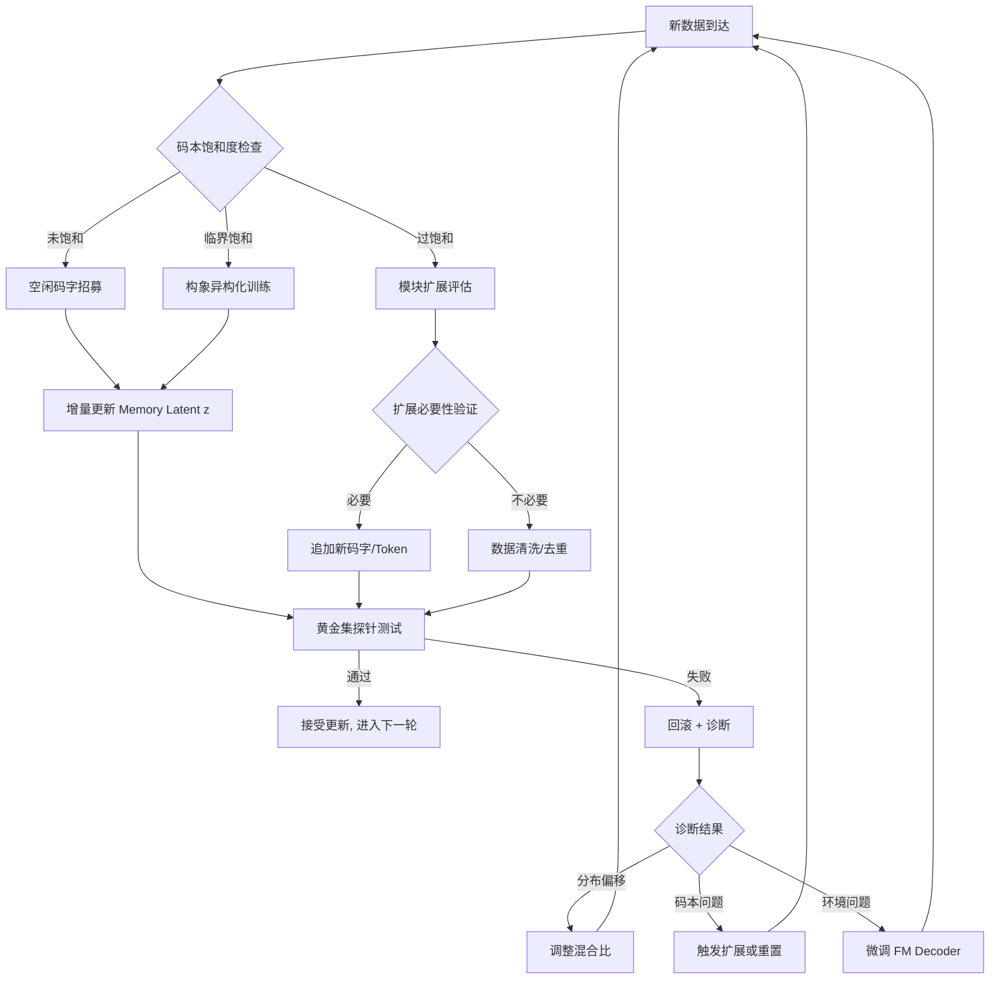
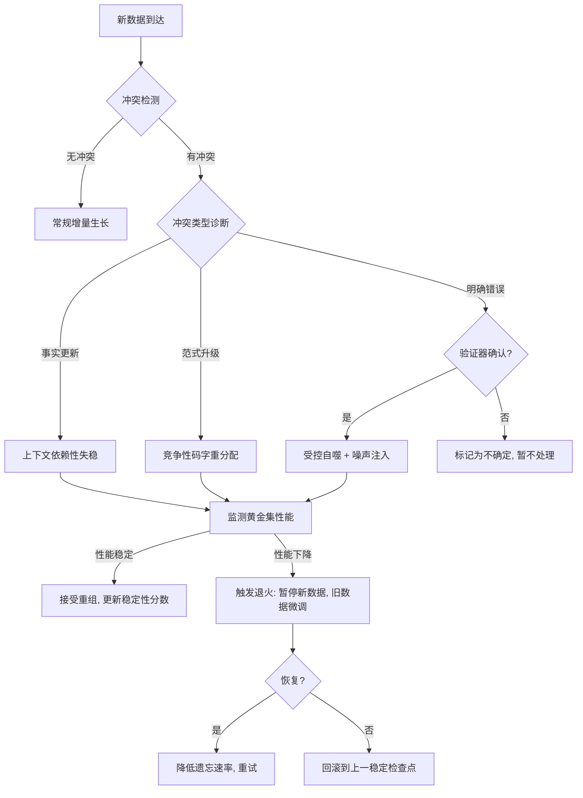

# SADKO 右脑生命周期管理：持续生长、结构化遗忘与系统存活条件

> **一句话定位**：右脑作为"活体认知系统"的运维框架——如何持续吸收新知识而不灾难性遗忘（稳态可塑性）、如何替代过时的图结构（受控自噬）、以及系统存活的六维检查清单
> **关联文档**：[hippo-graph-emergence.md](./hippo-graph-emergence.md)（自组装范式）· [hippo-phase0-manual.md](./hippo-phase0-manual.md)（Phase 0 基线）
> **最后更新**：2026-07-29

在分子生物学中，这对应**细胞稳态（Homeostasis）、受控生长、细胞自噬（Autophagy）与突触修剪（Synaptic Pruning）**的平衡。生长信号过强 → 癌变（模型崩溃/灾难性遗忘）；稳态机制过强 → 衰老停滞（无法吸收新知识）。SADKO 右脑的持续生长不能靠"无限微调"，必须建立**结构化的增量自组装协议**。

---

## 一、 核心原则：分离"生殖系"与"体细胞"

生物学中生殖系（DNA）永恒且受保护，体细胞（蛋白质）可消耗可更新。SADKO 必须做同样的架构分离：

| 组件 | 生物学类比 | 更新策略 | 防崩溃作用 |
| :--- | :--- | :--- | :--- |
| **FSQ 码本（Codebook）** | 遗传密码子表 | **冻结或极慢更新** | 确保"语言"不变，新旧知识用同一套离散符号表达 |
| **FM Encoder/Decoder 权重** | 核糖体/折叠酶 | **仅在新数据分布漂移时微调** | 保持翻译/折叠机器稳定 |
| **Memory Token 内容（latent $z$）** | 蛋白质组（Proteome） | **持续、快速更新** | 所有新知识编码在此，不触碰底层机器 |
| **主干 AR 网络** | 转录调控网络 | **独立维护，定期同步** | 上游稳定性保证 KV 底物质量 |

> **防崩溃第一定律：永远不要为了容纳新知识而修改 FSQ 码本的结构。** 码本是"通用氨基酸表"。如果为了学新领域改变码本含义，旧知识的"蛋白质"会全部错误折叠（灾难性遗忘）。新知识必须用已有码字组合表达；若现有码字不够用，说明初始码本容量不足，应回到 Phase 0 重新设计，而非在线修补。

---

## 二、 增量生长的三种安全模式

### 1. 空闲码字招募（Codon Recruitment）—— 首选 ⭐⭐⭐⭐⭐

- **机制**：FSQ 码本中通常有 20-40% 低频/未使用码字。新数据到来时优先激活这些"沉默基因"。
- **操作**：对新数据的 latent $z$ 施加稀疏正则化，鼓励使用当前利用率低的码字。
- **安全性**：完全不干扰已有码字的语义分配。

### 2. 构象异构化（Conformational Isomerism）—— 次选 ⭐⭐⭐⭐

- **机制**：同一 FSQ 码字序列在不同上下文（左脑 Query）下"折叠"出不同子图。新知识不是新码字，而是已有码字的新折叠态。
- **操作**：依赖左脑 Cross-Attention 的上下文敏感性；训练时增加 Multi-task/Multi-domain 数据混合，迫使模型学会"一码多义"。
- **安全性**：利用蛋白质天然的构象可塑性，但需验证新旧折叠态之间无干涉。

### 3. 模块扩展（Domain Accretion）—— 最后手段 ⭐⭐⭐

- **机制**：新知识确实超出已有码本表达能力时，**追加**新的 Memory Token 维度或新增专用码字组，而非修改已有部分（类似蛋白质进化中的"结构域融合"）。
- **操作**：新增部分与旧部分通过 Fact-Gate 桥接，内部参数独立。
- **安全性**：物理隔离保证旧知识安全，但增加系统复杂度。需设置严格的"扩展触发阈值"。

---

## 三、 防止"癌变"的免疫监控机制

### 3.1 弹性权重巩固（EWC）的分子版本

- **传统 EWC**：惩罚重要参数变化 → 过于刚性，阻碍生长。
- **SADKO 版本**：**仅对 FM Encoder/Decoder 的关键注意力头施加弹性约束，对 Memory Latent $z$ 完全放开**。
- **公式**：$\mathcal{L}_{total} = \mathcal{L}_{recon}^{new} + \lambda \sum_{h \in \mathcal{H}_{critical}} F_h (\theta_h - \theta_h^*)^2$
  - $\mathcal{H}_{critical}$：Phase 0 中标记为"结构核心"的注意力头
  - $F_h$：该头对旧知识重构的重要性（Fisher Information）
- **效果**：保护"折叠机器"的核心部件，允许外围适应新数据。

### 3.2 重构保真度探针（Reconstruction Fidelity Probe）

- **机制**：维护**"黄金标准测试集"**（覆盖所有已学领域的代表性样本）。
- **操作**：每 N 步增量更新后，在黄金集上跑 Recon MSE + 下游探针准确率。
- **熔断条件**：黄金集性能下降 > 2%，**立即回滚**到上一检查点并触发诊断：
  - 新数据分布偏移过大？→ 降低学习率 / 增加混合比例
  - 码本饱和？→ 触发模块扩展
  - 折叠环境退化？→ 检查双向注意力熵值

### 3.3 码字利用率均衡器（Codon Usage Balancer）

- **风险**：新数据导致少数码字过度使用，其他码字被"挤出" → 码本坍塌前兆。
- **机制**：实时监控 FSQ 码字频率分布。基尼系数超阈值时自动注入均匀噪声或重采样损失，强制恢复均衡。
- **生物学类比**：tRNA 丰度调节——细胞根据密码子使用偏好调整 tRNA 浓度，防止翻译瓶颈。

### 3.4 持续生长操作协议

---

## 四、 结构化遗忘：替代过时的图结构

> **核心纠偏**：生物系统从不通过"删除旧蛋白质"学习新构象。它通过**改变溶剂环境（上下文）**使旧构象热力学不稳定而自发解折叠，或通过**泛素化标记**将错误折叠蛋白送入蛋白酶体降解，腾出原料合成新蛋白。**SADKO 的"遗忘"不是擦除数据，而是解除旧结构的稳定性约束，使其在新的压缩压力下自然解体并重组。**

### 4.1 先诊断：区分旧结构类型

| 旧结构类型 | 生物学类比 | 处理策略 | 风险等级 |
| :--- | :--- | :--- | :--- |
| **过时但无害** | 沉默基因 / 储备蛋白 | **保留，降低表达权重** | ⭐ 安全 |
| **与新知冲突** | 错误折叠蛋白 / 朊病毒 | **主动解折叠 + 重组** | ⭐⭐⭐ 高危 |
| **冗余/低效** | 代谢废物 / 衰老细胞器 | **自噬回收** | ⭐⭐ 中危 |
| **核心基础** | 管家基因 / 核糖体RNA | **绝对保护** | ⚠️ 禁止触碰 |

> **第一原则：永远不要全局遗忘。只针对"与新数据重构损失显著负相关"的旧结构定向解折叠。** 不影响新知识 Recon Loss 的旧结构是"沉默基因"，留着比删了更安全（未来可能重新激活）。

### 4.2 定向解折叠的三种机制

#### 1. 上下文依赖性失稳（Context-Dependent Destabilization）—— 首选 ⭐⭐⭐⭐⭐

- **原理**：旧图结构稳定是因为它在旧数据分布下是自由能极小值。新数据引入后，双向注意力的能量景观变化，旧结构不再是极小值，自然"融化"。
- **操作**：新数据训练时**不冻结** FM Decoder 注意力权重；允许新数据梯度流回 Decoder，使其学会"在新语境下忽略旧模式"；旧 Memory Token 的 $z$ 因 Decoder 变化自动失去重构优势，被迫更新。
- **特点**：最自然的"遗忘"——没有显式删除，只有热力学驱动的相变。

#### 2. 竞争性码字重分配（Competitive Codon Reallocation）—— 次选 ⭐⭐⭐⭐

- **原理**：新旧知识争夺同一组 FSQ 码字时，重构损失更低的一方赢得码字使用权。失败方被迫用其他码字重组，或坍缩为噪声。
- **操作**：引入"码字竞争损失" $\mathcal{L}_{compete} = \max(0, \mathcal{L}_{recon}^{old} - \mathcal{L}_{recon}^{new} + \text{margin})$；新知识重构误差显著更低时，码字语义重心向新知偏移；旧知识要么适应新语义（重组），要么迁移到空闲码字。
- **注意**：监控码字迁移是否导致旧知识在其他位置形成"异位聚集"。

#### 3. 受控自噬（Targeted Autophagy）—— 最后手段 ⭐⭐

- **原理**：对明确有害的旧结构（事实性错误、逻辑矛盾）主动标记并降解。
- **操作**：**标记**（外部验证器或左脑探针识别"高置信度错误"的 Memory Token）→ **降解**（对 latent $z$ 施加高斯噪声注入或零化正则，强制脱离当前吸引子盆地）→ **回收**（释放的码字和注意力带宽立即被新数据梯度占据，防止真空被其他错误结构填充）。
- **警告**：有效但危险。必须有高精度验证器，误删核心知识会导致系统性崩溃。**仅在 Phase 1+ 且监控完备时使用。**

### 4.3 防止"过度遗忘"的免疫耐受机制

| 机制 | 原理 | 实现 |
| :--- | :--- | :--- |
| **知识半衰期标签** | 为每个 Memory Token 维护"稳定性分数" $s_t$（基于历史重构成功率、被 Query 激活频率、与黄金集相关性） | $\Delta z_t \propto \frac{\nabla \mathcal{L}_{new}}{1 + \alpha \cdot s_t}$——高分 Token 对解折叠信号有更高抵抗力 |
| **重组验证门控** | 旧结构解体后、新结构形成前的"熔融态"过渡期系统最脆弱 | 过渡期内临时提高黄金测试集采样权重；若退化立即暂停新数据注入，在纯旧数据上"退火"恢复（热休克反应类比） |
| **多尺度遗忘速率** | 不同抽象层级应有不同可塑性 | 表层事实（实体属性、时效信息）→ 快遗忘；中层关系（因果链、分类体系）→ 中速；深层范式（逻辑规则、世界模型）→ 极慢近乎冻结。按 Phase 0 标记的抽象层级分配学习率衰减系数 |

### 4.4 结构化遗忘操作协议

### 4.5 认知升级：遗忘不是破坏，是流动的另一种形式

| 传统观点 | SADKO 分子自组装观点 |
| :--- | :--- |
| 遗忘 = 删除数据 | 遗忘 = **解除旧结构的稳定性约束** |
| 新知识替换旧知识 | 新知识**改变能量景观**，使旧构象不再稳定 |
| 全量微调导致灾难性遗忘 | **分层遗忘速率** + **稳定性分数**保护核心 |
| 遗忘是被动的副作用 | 遗忘是**主动的、受控的结构重组过程** |
| 目标是最小化训练损失 | 目标是维持**动态平衡下的功能性构象** |

知识是构象，不是物质。不需要"拆掉旧桥建新桥"——只需改变水流方向和速度（新数据分布 + 解码器更新），旧沙洲会被冲刷重塑，新河道自然涌现。工程任务不是设计"删除按钮"，而是设计**足够敏感的能量景观**，让系统在"固守旧结构"和"盲目追随新噪声"之间找到持续演化的窄路——这条路叫**稳态可塑性（Homeostatic Plasticity）**。

---

## 五、 系统存活的六维检查清单

从"理论模型"到"工程落地"的完整检查清单。遗漏任何一项，系统都可能从"活细胞"退化为"癌细胞"或"死结晶"。

### 5.1 能量代谢与热力学约束

*没有能量流就没有耗散结构。SADKO 不是平衡态系统，必须持续耗能维持有序。*

1. **计算预算分配（Metabolic Budgeting）**：双向注意力 + FM 重构成本远高于单向 AR。引入"代谢门控"——仅对高不确定性/高信息密度 KV 片段启动完整 SADKO 通路，低熵片段走轻量旁路。指标：每 Token 平均 FLOPs 应随训练收敛而**下降**（系统学会"节能"）。
2. **温度调度（Temperature Annealing）**：FSQ 量化和注意力软化的"温度"参数需**非单调退火曲线**——初期高温探索构象空间 → 中期降温稳定核心模块 → 后期周期性"热脉冲"防僵化。
3. **自由能下界监控**：Recon Loss 下降不代表结构正确。维护理论最小重构误差估计（基于数据信息熵）；若实际 Loss 远低于下界，说明模型在"作弊"（记忆而非压缩），需增加正则化。

### 5.2 形态发生与拓扑约束

4. **层级模块化先验**：FM Encoder 嵌入多尺度注意力掩码（Local → Regional → Global），强制 latent space 形成嵌套社区结构。验证：模块度 Q 值在 0.3–0.7 合理区间，随抽象层级递增。
5. **因果方向性约束**：双向注意力产生的图是无向的，但推理需要因果方向。Decoder 引入非对称交叉注意力或时序位置编码偏置。验证：干预实验中扰动原因节点应比扰动结果节点产生更大的重构误差传播。
6. **稀疏性与连通性动态平衡**：自适应 L0/L1 正则，强度由图谱间隙自动调节——间隙过小（连通差）→ 降低稀疏惩罚；过大（过度耦合）→ 增强稀疏惩罚。

### 5.3 左右脑协同与接口协议

7. **查询路由机制**：训练轻量"置信度门控器"——左脑 next-token 熵 > 阈值或检测到实体/关系关键词时才激活右脑检索。门控器必须与右脑同步训练，避免"该用时不用，不该用时乱用"。
8. **KV ↔ Latent 对齐损失**：除 Recon MSE 外增加对比学习损失，确保同一实体的右脑 latent 与左脑 KV 在共享嵌入空间接近。权重随训练递减（早期对齐，后期允许右脑独立表征）。
9. **反馈回路**：右脑重构 KV 作为**软提示**注入左脑后续层而非硬替换，注入强度由 Fact-Gate 控制，允许左脑"质疑"右脑。

### 5.4 鲁棒性与容错机制

10. **码本冗余与纠错**：设计重叠码本或校验码字，关键知识由多码字组合编码。验证：随机掩码 10% 码字后重构性能下降 < 5%。
11. **对抗性扰动训练**：训练时对 KV 注入结构化噪声（模拟真实数据缺陷模式而非高斯噪声），迫使系统学习平滑能量景观。
12. **优雅降级**：右脑置信度低于阈值时自动回退纯左脑生成并标记"未经验证"，绝不输出垃圾。

### 5.5 评估与可观测性

13. **结构探针套件**：必测——谱间隙、模块度、平均路径长度、聚类系数、码字利用率基尼系数；动态指标——上述指标随训练步数的导数（生长速度、相变点检测）。
14. **功能性下游探针**：不直接评估图，而是评估图支持的任务（Multi-hop QA、反事实推理、时序排序、实体消歧）。探针必须与右脑解耦训练，避免成为捷径。
15. **可解释性可视化**：Attention Map 热力图、Latent Space UMAP、码字语义聚类树，每 N 步自动生成，人工抽检异常模式。

### 5.6 工程实现与基础设施

16. **显存与通信优化**：KV Cache 分页存储、FSQ 码本分片并行、梯度检查点、混合精度训练。
17. **增量训练流水线**：黄金集测试 + 熔断机制 + 退火恢复构成复杂状态机，需专用训练框架支持检查点热加载、动态数据混合、实时监控告警。
18. **版本化与可复现性**：自组装系统对初始条件敏感。严格记录所有随机种子、数据顺序、超参轨迹；每个稳定检查点附带完整"系统健康报告"。

### 5.7 终极存活条件表

| 维度 | 必要条件 | 失败后果 |
| :--- | :--- | :--- |
| **热力学** | 持续能量流 + 非平衡态 | 热寂 / 过拟合 |
| **形态** | 层级模块化 + 因果方向 | 扁平噪声 / 推理失效 |
| **协同** | 精准路由 + 语义对齐 | 幻觉 / 左右脑割裂 |
| **鲁棒** | 冗余编码 + 优雅降级 | 脆弱 / 灾难性输出 |
| **评估** | 结构+功能双探针 | 盲目优化 / 虚假进步 |
| **工程** | 显存优化 + 状态机 | 无法训练 / 不可复现 |

---

> **总结**：SADKO 的持续生长不是"学习"，而是**新陈代谢**。旧知识不会被"覆盖"，只是进入低表达状态（像管家基因）；新知识不会"替换"旧知识，而是被整合进已有调控网络。系统的智能不在于记住了多少，而在于**任何时刻都能正确折叠出当前任务所需的蛋白质构象**。
>
> 这份清单不是"功能列表"，而是**生命体征监测表**。右脑不是一次性交付的软件产品，而是需要持续监护的认知有机体。启动前请确保每一项都有：明确的量化阈值、自动化的监控脚本、预定义的应急干预预案。
>
> **防崩溃的本质，不是阻止变化，而是确保变化发生在正确的层级。让 Memory 流动，让码本永恒，让折叠机器稳健——这就是 SADKO 右脑的长生之道。**
