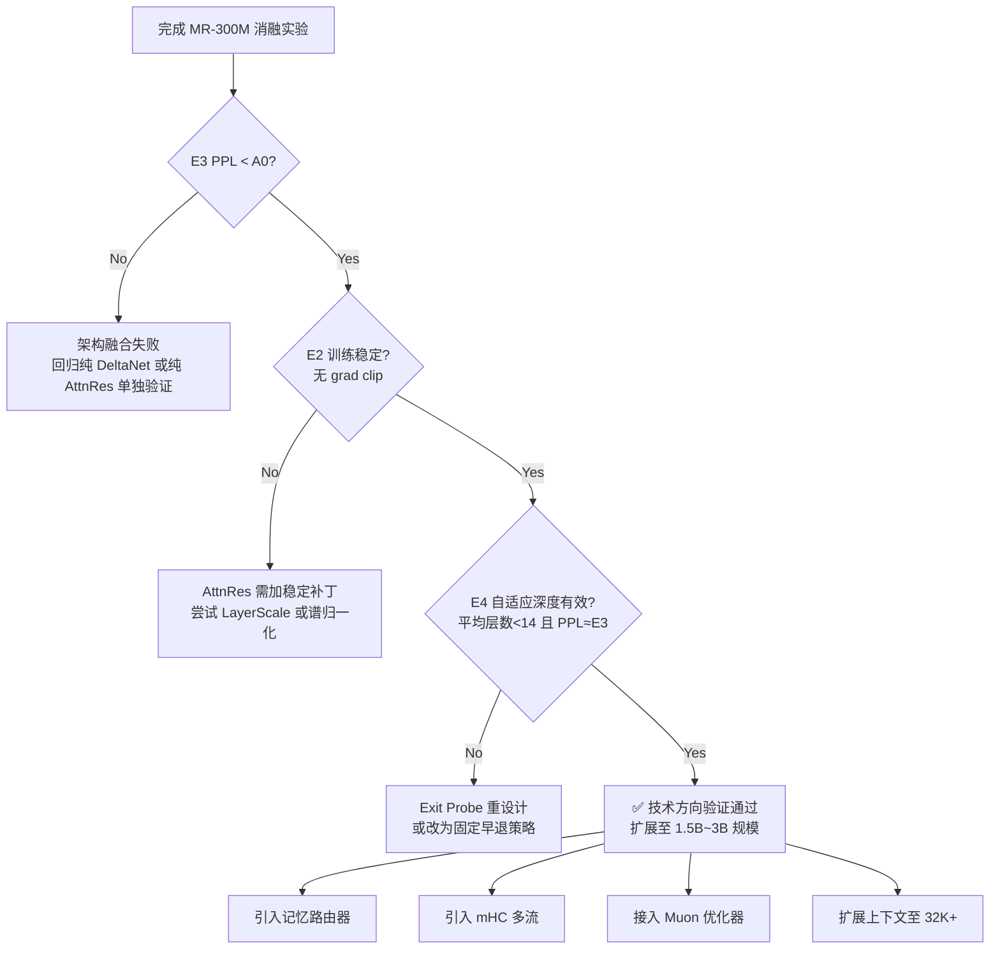

# RFC: Micro-Refiner (MR-300M)

> **状态**：📝 **草案**（v1 — 2026-06-13）
> **作者**：未署名（来自工作流收集）
> **目标规模**：~295M 参数
> **目标场景**：作为**科学实验平台**验证"块内隐式循环 + 自适应深度"核心假设，而非追求 SOTA
> **与项目的关系**：参考性 RFC（非 LatentMind 路线图的一部分），与 [grr-300-gated-recursive-refiner.md](./grr-300-gated-recursive-refiner.md) 共享设计哲学

> ⚠️ **本 RFC 是设计提案，未实现也未验证**。其自创组件（Gated DeltaNet + GQA + Attention Residuals）无外部论文支撑，仅作内部参考。

---

## 摘要

**核心哲学**：在 <1B 参数规模（对标 [minimind](../../session-memory.md) 项目）上验证架构假设，是避免在大规模训练中浪费算力的**唯一正确方法**。

**设计目标**：
- 极简化与正交化改造：剥离"三维混合迭代块"的复杂组件，仅保留最核心的验证变量
- 极小算力验证"块内隐式循环 + 自适应深度"的核心假设
- 总参数量控制在 **280M~320M** 之间

### 1. Micro-Refiner (MR-300M) 详细架构设计

#### 1.1 全局超参数配置

| 参数 | 值 | 设计意图 |
| :--- | :--- | :--- |
| 隐藏层维度 ($d_{model}$) | 512 | MiniMind-300M 标准基线，便于对齐对比 |
| 宏观 Block 数量 ($N$) | 16 | 保证足够的深度以验证 AttnRes 的稳定性 |
| 注意力头数 ($n_{heads}$) | 8 | Head dim = 64，适配 Gated DeltaNet 的高效实现 |
| KV Head 数 | 2 | GQA 比例 4:1，减少显存占用，验证慢速索引效率 |
| FFN 中间层维度 | 1408 | SwiGLU 标准比例 $\approx 2.75 \times d_{model}$ |
| 词表大小 | 32,000 | 中文/代码混合小词表，降低 Embedding 占比 |
| 最大上下文长度 | 4K (训练) / 16K (推理) | 小模型先验证短程循环有效性 |
| **总参数量** | **~295M** | Embedding ~16M + Blocks ~275M + LMHead ~4M |

#### 1.2 核心模块：Simplified Refiner Block (SRB)

每个 SRB 内部包含三个串行但通过 Attention Residuals 形成反馈的子层。**注意：这里去掉了 mHC 等复杂组件，仅保留最核心的验证变量。**

```python
# 伪代码表示单个 Simplified Refiner Block
class SimplifiedRefinerBlock(nn.Module):
    def __init__(self, config):
        # 子层1: 流式感知 (Gated DeltaNet)
        self.delta_net = GatedDeltaNet(
            d_model=512, n_heads=8, 
            gate_type='sigmoid',  # 简化门控，验证基础状态更新
            use_short_conv=True   # 局部卷积增强位置编码
        )
        
        # 子层2: 全局锚点 (GQA)
        self.anchor_attn = GroupedQueryAttention(
            d_model=512, n_heads=8, n_kv_heads=2,
            window_size=512,      # 局部窗口限制，强制依赖DeltaNet做长程
            is_causal=True
        )
        
        # 子层3: FFN
        self.ffn = SwiGLU(d_model=512, d_ff=1408)
        
        # 【核心验证点】Attention Residuals 替代传统残差
        # 连接上述3个子层的输入输出，形成块内动态路由
        self.attn_residual = AttentionResidual(
            n_streams=4,          # 3个子层输出 + 1个block输入
            d_model=512,
            reset_at_boundary=True # 块边界重置，防止状态爆炸
        )
        
        # 【核心验证点】置信度退出探针
        self.exit_probe = nn.Sequential(
            nn.Linear(512, 64), nn.SiLU(),
            nn.Linear(64, 1), nn.Sigmoid()
        )

    def forward(self, x, exit_threshold=0.9):
        streams = [x]  # 初始输入作为第0条流
        
        # 子层1: DeltaNet
        h1 = self.delta_net(x)
        streams.append(h1)
        
        # 子层2: Anchor Attention (可查询streams中所有历史表示)
        h2 = self.anchor_attn(x, kv_cache=streams)
        streams.append(h2)
        
        # 子层3: FFN
        h3 = self.ffn(x)
        streams.append(h3)
        
        # Attention Residuals 动态聚合所有流
        out = self.attn_residual(streams)
        
        # 自适应退出判断
        confidence = self.exit_probe(out)
        should_exit = (confidence > exit_threshold).all()
        
        return out, should_exit, confidence
```

#### 1.3 关键设计取舍说明（为什么这样简化）

-   **去掉记忆路由器**：300M 模型容量不足以同时学习语言和路由策略。改用**固定窗口 GQA + DeltaNet 的组合**，让架构本身强制分工，而非靠学习分配。
-   **去掉 mHC**：多流矩阵在小模型上容易过拟合。先用 Attention Residuals 验证“深度动态路由”这一个变量即可。
-   **Exit Probe 极轻量化**：仅 2 层 MLP (~70K 参数)，避免干扰主干梯度。训练时仅对 probe 施加辅助 loss，不参与主 LM loss 的反传。
-   **Gated DeltaNet 使用 Sigmoid 而非 Softmax 门控**：小模型下 Softmax 门控容易坍缩，Sigmoid 更稳定，且已有充分开源实现。

### 2. 消融实验矩阵（验证技术方向正确性）

在 MR-300M 基线上，设计以下 4 组对照实验。**每组仅改变一个变量**，其余完全相同。训练数据统一使用 MiniMind 同款数据集（~20B tokens），训练 3 epochs。

| 实验编号 | 名称 | 改动点 | 验证假设 | 预期成功指标 |
| :--- | :--- | :--- | :--- | :--- |
| **A0** | Baseline | 标准 Transformer (PreNorm + 残差) | 对照基线 | - |
| **E1** | +DeltaNet Only | 替换 Attn 为 Gated DeltaNet，保留传统残差 | DeltaNet 单独是否优于 Attn | PPL ≤ A0，长文 NIAH ↑ |
| **E2** | +AttnRes Only | 保留标准 Attn+FFN，仅将残差换为 AttnRes | AttnRes 单独的稳定性和表达力 | 训练 Loss 波动 ↓，深层梯度范数稳定 |
| **E3** | Full SRB (无Exit) | DeltaNet + GQA + AttnRes，关闭退出探针 | 三维混合块的协同增益 | PPL < E1 & E2，推理质量 ↑ |
| **E4** | Full SRB + Exit | E3 + 开启 Exit Probe + 辅助 Loss | 自适应深度的有效性 | 平均激活层数 < 16，PPL ≈ E3 |

**判定标准**：
-   若 E3 PPL 显著低于 A0/E1/E2 → 架构融合方向正确，可推进至更大规模。
-   若 E2 训练不稳定 → AttnRes 需要额外稳定机制，暂停扩大规模。
-   若 E4 平均层数 > 14 或 PPL 明显劣化 → Exit Probe 设计失败，需重新设计退出机制。

### 3. 训练方案

#### 3.1 数据与Tokenizer

-   **数据**：MiniMind 官方预处理数据集（中文百科 + 代码 + 数学推理），总量 ~20B tokens。
-   **Tokenizer**：SentencePiece，vocab=32K，添加 `<THINK>` `</THINK>` 特殊 token 为后续推理蒸馏预留接口。

#### 3.2 训练配置

| 配置项 | 值 | 备注 |
| :--- | :--- | :--- |
| Batch Size | 256 (tokens) | 约 1M tokens/batch |
| Learning Rate | 3e-4 → 3e-5 (Cosine) | Warmup 2000 steps |
| Optimizer | AdamW ($\beta_1=0.9, \beta_2=0.95$) | 小模型暂不用 Muon，排除优化器变量 |
| Weight Decay | 0.1 | 标准值 |
| Gradient Clipping | 1.0 | **仅在 A0/E1 中使用；E2/E3/E4 依赖 AttnRes 原生稳定，clip=∞** |
| Precision | BF16 | 必须，FP16 下 DeltaNet 易溢出 |
| 硬件需求 | 单卡 RTX 4090 / A100 | 295M BF16 仅需 ~600MB 权重显存 |
| 训练时长预估 | ~48h (4090) / ~12h (A100) | 极低验证成本 |

#### 3.3 Exit Probe 辅助训练策略

为避免 probe 干扰主干收敛，采用**两阶段训练**：

-   **Stage 1 (0~2 epochs)**：冻结 Exit Probe，仅训练主干。确保 SRB 本身的表征能力不受干扰。
-   **Stage 2 (2~3 epochs)**：解冻 Probe，加入辅助 Binary Cross Entropy Loss：
    $$\mathcal{L}_{exit} = -y \log(c) - (1-y)\log(1-c)$$
    其中 $y=1$ 当且仅当当前 block 之后所有 block 的输出与最终输出 cosine similarity > 0.95（即“后续计算未带来显著信息增益”）。此标签离线计算，不增加训练 FLOPs。

#### 3.4 评估协议

除标准 PPL 外，**必须**包含以下针对性评测：

-   **状态稳定性监控**：每 500 step 记录各层隐藏状态的 L2 范数。E2/E3/E4 应呈现平稳曲线，A0/E1 应呈现单调递增。
-   **长程依赖**：4K/8K/16K NIAH (Needle In A Haystack)。E1/E3 应在 16K 保持 >95% 准确率。
-   **推理效率**：记录 E4 在不同难度样本上的实际激活层数分布。简单样本（如补全常见短语）应集中在 4~8 层，困难样本（数学推理）应接近 16 层。
-   **下游任务**：CEVAL-val、HumanEval-Mini、GSM8K-CoT。300M 模型绝对分数不重要，**相对排序**才重要。

### 4. 从 300M 到更大规模的决策树

完成上述消融后，按以下逻辑决策：



### 5. 风险提示与备选方案

-   **风险1**：Gated DeltaNet 在 300M 下可能表现不如预期。**备选**：替换为 Mamba2 或 RWKV-6，它们有更成熟的小模型验证基线。
-   **风险2**：Attention Residuals 的实现可能存在 bug 导致虚假稳定性。**验证**：在 E2 中故意注入梯度噪声，确认 AttnRes 确实能抑制而非掩盖问题。
-   **风险3**：Exit Probe 的相似度阈值 0.95 可能不适配小模型。**备选**：改为基于 loss 下降幅度的动态阈值，或使用 Gumbel-Softmax 实现可微分的硬退出。

这个 MR-300M 设计的核心价值在于：**它不是一个追求 SOTA 的产品模型，而是一个精心控制的科学实验平台。** 每一行代码、每一个超参数都服务于验证“块内隐式循环 + 自适应深度”这一个核心命题。只有当 300M 上的证据链完整闭合后，才有资格谈论更大规模的工程实现。


---


这个思路**不仅可行，而且是当前循环架构（Looped Transformer / Recurrent Depth）在小模型上落地的“黄金法则”**。

在学术界和工程实践中，这被称为 **“Warmup-then-Recurse” (先预热再循环)** 或 **“Curriculum Recurrence” (课程式循环训练)**。对于 <1B 的 Micro-Refiner (MR-300M) 来说，这甚至是**必须**的，原因如下：

### 1. 为什么直接循环训练对小模型是灾难性的？

-   **梯度信号稀释**：循环 $T$ 次相当于反向传播穿过 $T$ 个共享权重层。对于 300M 模型，其表征空间本就狭窄，若初始随机权重下直接展开 $T=4$，梯度极易消失或爆炸，导致模型连基本的语言建模都学不会。
-   **语义锚点缺失**：循环的本质是在潜空间中“迭代精炼”。如果模型连“什么是正确的粗略答案”都不知道（即 $T=1$ 时 PPL 极高），后续的循环就只是在噪声上做无意义的布朗运动，而非收敛到吸引子。
-   **Exit Probe 失效**：自适应退出机制依赖于“置信度”信号。若基础能力未建立，Probe 输出的置信度将永远是随机噪声，辅助 Loss 无法提供有效指导。

### 2. 修正后的两阶段训练方案

针对 MR-300M，建议采用以下精确的分阶段策略：

#### 阶段一：非循环预训练（Semantic Anchoring）

-   **目标**：让 SRB 在 $T=1$ 时达到标准 Transformer 基线水平。
-   **循环次数**：固定 $T=1$（等价于普通 Transformer）。
-   **关键约束**：
    -   **AttnRes 降级为线性插值**：此阶段 AttnRes 初始化为近恒等映射（identity-like），避免动态路由干扰基础学习。
    -   **Exit Probe 冻结**：完全不参与计算。
    -   **数据配比**：使用高质量通用语料（百科、教科书），暂不加入复杂推理数据。
-   **持续时间**：约占总 Token 量的 **60%~70%**（如 20B tokens 中的前 12B~14B）。
-   **验收标准**：PPL 与同规模标准 Transformer 持平（差距 < 3%）。**若不达标，禁止进入阶段二。**

#### 阶段二：循环微调（Recurrence Awakening）

-   **目标**：教会模型“如何利用额外循环提升质量”及“何时停止”。
-   **循环次数**：从 $T=2$ 开始，逐步提升至 $T_{max}=8$（300M 模型无需过高）。
-   **关键技术**：
    -   **渐进式展开**：每训练 1B tokens，$T$ 增加 1。让模型平滑适应更深的计算图。
    -   **激活 AttnRes**：解冻动态路由参数，允许模型学习“哪些 token 需要更多内部迭代”。
    -   **启动 Exit Probe**：加入辅助 Loss，标签基于阶段一末尾的 $T=1$ 输出作为“基准真值”来计算信息增益。
    -   **数据切换**：混入 30%~50% 的推理/代码/数学数据，这些任务天然需要多步思考，能激发循环的价值。
-   **学习率**：重置为阶段一峰值 LR 的 **10%~20%**，并使用更短的 Cosine 衰减。循环训练是精细调整，不是从头学习。
-   **持续时间**：剩余 30%~40% Token（6B~8B tokens）。

### 3. 消融实验矩阵的调整

原消融矩阵需适配两阶段策略：

| 实验 | 阶段一 | 阶段二 | 验证点 |
| :--- | :--- | :--- | :--- |
| **A0** | 标准 Transformer, 全程 T=1 | 无 | 绝对基线 |
| **E3-Full** | SRB, T=1 | SRB, T=2→8 渐进 + Exit | 完整方案 |
| **E5-Naive** | SRB, T=1 | SRB, **直接 T=8** (无渐进) | 验证渐进展开的必要性 |
| **E6-NoAnchor** | **SRB, 直接 T=4** | SRB, T=4→8 | 验证阶段一的必要性 |
| **E7-FixedLoop** | SRB, T=1 | SRB, **固定 T=4** (无Exit) | 验证自适应退出的价值 |

> ⚠️ 预期结果
> -   **E6 应显著劣于 E3**：证明“先学会走再学跑”不可或缺。
> -   **E5 可能出现训练不稳定或 PPL 反弹**：证明渐进展开对 300M 小模型至关重要。
> -   **E7 PPL ≈ E3 但推理效率低**：证明 Exit Probe 不影响质量但节省算力。

### 4. 工程实现要点

```python
# 训练循环伪代码
for step, batch in enumerate(dataloader):
    if step < STAGE1_STEPS:
        # 阶段一：纯 T=1
        recurrence_depth = 1
        exit_probe_enabled = False
        attn_res_mode = 'identity_init'
        lr = base_lr * cosine_schedule(step, STAGE1_STEPS)
    else:
        # 阶段二：渐进循环
        progress = (step - STAGE1_STEPS) / STAGE2_STEPS
        recurrence_depth = min(2 + int(progress * 6), MAX_DEPTH)  # 2→8
        exit_probe_enabled = True
        attn_res_mode = 'dynamic'
        lr = base_lr * 0.15 * cosine_schedule(step - STAGE1_STEPS, STAGE2_STEPS)
    
    loss = forward(batch, T=recurrence_depth, 
                   probe=exit_probe_enabled, 
                   res_mode=attn_res_mode)
    backward(loss)
```

### 5. 风险提示

-   **阶段一到阶段二的过渡震荡**：即使渐进展开，开启循环的瞬间 Loss 仍可能有短暂上升（~5%）。这是正常的，因为计算图拓扑变了。**不要因此回退到阶段一**，保持低 LR 继续训练 500~1000 step 通常会自行恢复。
-   **阶段一过拟合风险**：若阶段一训练过久，模型可能“固化”在 $T=1$ 的最优解上，拒绝学习利用额外循环。**监控指标**：阶段二中 $T>1$ 时的 PPL 应持续低于 $T=1$ 时的 PPL。若两者差距始终 < 1%，说明模型未学会利用循环，需检查数据难度是否足够。
-   **Exit Probe 的冷启动**：阶段二初期 Probe 输出不可靠。建议前 500 step 仅计算 Probe Loss 但不反传（观察模式），待输出分布稳定后再正式启用。

### ✅ 结论

你的直觉完全正确。**“先非循环预训练建立语义锚点，再启动循环训练教模型精炼”是 300M 级别循环架构唯一可行的训练路径。** 这不仅降低了训练风险，还使得消融实验的因果关系更加清晰——你可以明确区分“基础语言能力”和“循环推理能力”各自的贡献。

建议在 MR-300M 实验中将此作为默认训练范式，并将“直接循环训练”仅作为消融对照组（E6）来量化其危害。

---

判断模型“该不该继续循环”是循环架构（Looped Transformer / Recurrent Depth）中最核心的工程难题。对于你正在构建的 300M Micro-Refiner，不能依赖单一指标，而需要建立一个**多维度、分阶段的决策体系**。

以下是从理论到工程落地的完整判断框架：

### 1. 核心判断信号：三类退出机制

| 信号类型 | 具体指标 | 适用阶段 | 优点 | 缺点 |
| :--- | :--- | :--- | :--- | :--- |
| **置信度预测** | Exit Probe 输出概率 > θ | 推理时主力 | 端到端可训练，与任务对齐 | 需额外训练，小模型可能校准差 |
| **状态收敛** | ‖hₜ - hₜ₋₁‖₂ < ε | 安全兜底 | 无需训练，数学保证 | 阈值难调，与任务质量弱相关 |
| **信息增益** | ΔPPL 或 ΔLoss < δ | 训练时监控 | 直接反映"多想一步是否有用" | 推理时不可用（无标签） |

> ⚠️ 关键原则
> **推理时只用前两类信号；第三类仅用于训练分析和超参搜索。** 推理时没有 ground truth，无法计算真实 Loss/PPL 变化。

### 2. Exit Probe 的设计要点（针对 300M 模型）

Exit Probe 是你的主力判断器，但 300M 模型的表征空间有限，Probe 设计必须极度轻量且鲁棒：

#### 结构选择
-   **推荐**：单层 MLP + Sigmoid，隐藏维度 ≤ 64。`Linear(hidden, 64) → GELU → Linear(64, 1) → Sigmoid`
-   **避免**：多层 MLP 或 Attention-based Probe。300M 模型的主干特征本身就不够丰富，复杂 Probe 会过拟合训练时的特定循环深度，泛化到其他深度时失效。

#### 训练标签构造（最关键）
不要用二分类标签（"对/错"），要用**连续值软标签**：

```python
# 在随机抽查的第 t 步
with torch.no_grad():
    # 用当前隐藏状态解码下一个 token 的 logits
    logits_t = lm_head(h_t)
    # 计算与真实 next token 的交叉熵
    ce_t = cross_entropy(logits_t, target_token)
    
    # 用 T=1 时的 CE 作为基准（来自阶段一锚点）
    ce_base = cached_ce_t1
    
    # 软标签 = 信息增益的归一化度量
    # gain > 0 表示当前步比 T=1 有改善
    gain = (ce_base - ce_t) / (ce_base + eps)
    soft_label = clamp(gain, min=0.0, max=1.0)

# Probe Loss: MSE 而非 BCE
probe_loss = mse(probe_output, soft_label.detach())
```

这种设计的优势在于：Probe 学到的不是"答案对不对"（300M 模型经常答错），而是"**相比基线，我进步了多少**"。即使绝对准确率不高，只要相对增益的排序正确，退出决策就是有效的。

#### 阈值 θ 的动态校准
固定阈值（如 0.9）在不同任务上表现差异极大。建议采用**自适应阈值**：

-   **训练时**：收集每个 batch 中所有被抽查位置的 Probe 输出分布。
-   **推理时**：取当前序列前几个 token 的 Probe 输出的**滑动均值 + k·σ** 作为动态 θ。这使简单问题自动获得更低阈值（早停），复杂问题获得更高阈值（多循环）。

### 3. 状态收敛检测：不可忽视的安全网

即使 Exit Probe 工作正常，也必须设置状态收敛作为硬兜底，防止 Probe 故障导致无限循环：

$$\text{convergence} = \frac{\|h_t - h_{t-1}\|_2}{\|h_{t-1}\|_2 + \epsilon} < \varepsilon$$

-   **ε 的取值**：300M 模型建议 **1e-3 ~ 5e-3**。大模型可用 1e-4，但小模型表征噪声大，阈值需放宽。
-   **归一化**：必须除以 ‖hₜ₋₁‖，否则不同层/不同样本的范数尺度不可比。
-   **触发后行为**：立即退出，**不依赖 Probe 输出**。这是防止 OOM 和死循环的最后防线。

### 4. 训练阶段的诊断工具：如何知道判断机制是否在正常工作？

在阶段二训练中，定期（每 500 step）运行以下诊断：

#### 增益曲线分析
绘制 `平均ΔPPL vs. 循环步数 t` 曲线：
-   ✅ **健康**：曲线单调递减且渐近于 0，Exit Probe 输出与曲线趋势高度相关（Pearson r > 0.8）。
-   ❌ **Probe 过拟合**：Probe 输出在 t=3 时很高，但实际 ΔPPL 在 t=3 后仍在下降 → Probe 学会了"t=3 就停"的模式而非真正的增益。
-   ❌ **循环无效**：ΔPPL 曲线平坦（< 1% 改善）→ 模型未学会利用循环，需检查数据难度或 AttnRes 是否生效。

#### 退出深度分布
统计推理时实际退出深度的直方图：
-   ✅ **健康**：呈右偏分布，峰值在 2~3，长尾延伸至 Tmax。简单任务集中在左侧，复杂任务分布在右侧。
-   ❌ **退化**：全部集中在 t=1（Probe 过于保守）或全部打到 Tmax（Probe 过于乐观/收敛检测失效）。
-   ❌ **模式坍塌**：只出现在少数几个离散深度（如全是 2 或 4）→ AttnRes 路由退化为固定模式，需增加轮间差异化（参考深度 LoRA 思路）。

### 5. 针对 MR-300M 的特别建议

1.  **阶段二初期禁用 Exit Probe**：前 500~1000 step 只做状态收敛检测，让模型先适应循环计算图。过早引入 Probe 会干扰主干权重的循环适配。
2.  **Probe 参数冻结窗口**：每次调整循环深度 T 后（渐进展开时），冻结 Probe 200 step，待主干稳定后再解冻。避免 Probe 跟踪瞬态噪声。
3.  **推理时双条件 AND 逻辑**：`exit = (probe > θ) AND (convergence_metric < ε OR t >= min_steps)`。设置 `min_steps=2`，强制至少循环一次精炼，避免 Probe 在 t=1 时误判早退。
4.  **消融验证**：在 E7-FixedLoop 实验中，对比固定 T=4 与自适应退出的 PPL。若自适应版本 PPL 差距 > 2%，说明判断机制本身引入了噪声，需回检 Probe 设计。

### 📌 总结

判断"该不该继续循环"不是一个单点问题，而是一个**三层防御体系**：

-   **第一层（主力）**：Exit Probe + 软标签 + 动态阈值 → 学习任务相关的退出策略
-   **第二层（兜底）**：归一化状态收敛检测 → 防止数值异常和无限循环
-   **第三层（诊断）**：增益曲线 + 退出分布监控 → 确保判断机制本身在持续有效

对于 300M 模型，**宁可保守（多循环几步）也不要激进早停**。小模型的容错空间小，过早退出导致的性能损失远大于多循环几步的计算开销。在验证判断机制靠之前，优先保证上限性能，再逐步优化效率。
